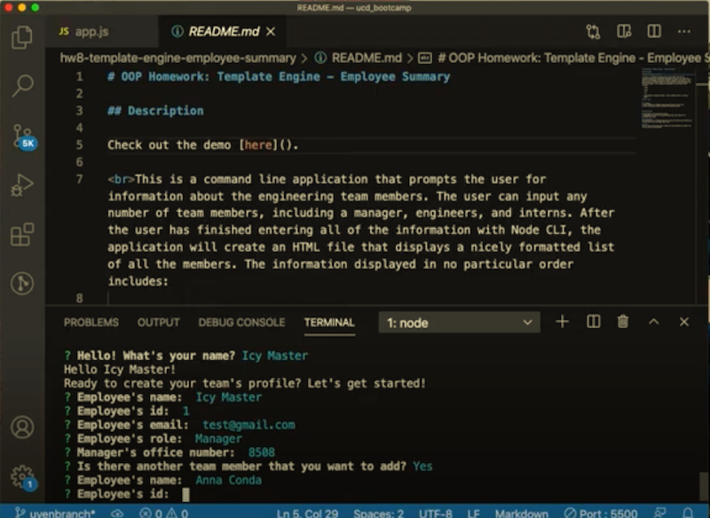
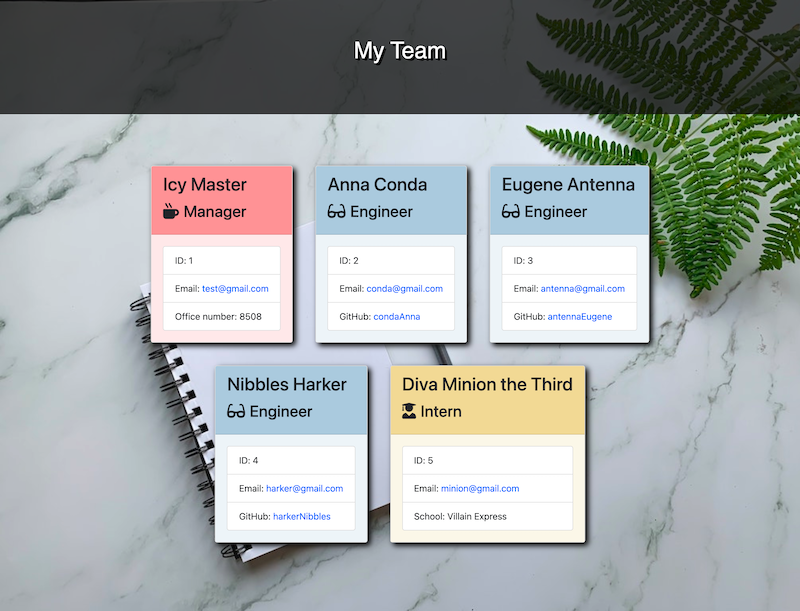

# 10 OOP Homework: Template Engine - Employee Summary

## Description

Check out the demo [here](https://www.youtube.com/watch?v=mgobiGCxkQ4&feature=youtu.be&ab_channel=UyenNguyen).

This is a command line application that prompts the user for information about the engineering team members. The user can input any number of team members, including a manager, engineers, and interns. After the user has finished entering all of the information with Node CLI, the application will create an HTML file that displays a nicely formatted list of all the members. The information displayed in no particular order includes: 

  * Name

  * Role

  * ID

  * Role-specific property (School, link to GitHub profile, or office number)

## User story

```
As a manager,
I want to generate a webpage that displays my team's basic info
so that I have quick access to emails and GitHub profiles

```

## Screenshots

* Using CLI to prompt user for information


* Output HTML page


## Installation

Install Node js and npm before running.
<br>Dependencies: jest for running provided tests and inquirer for prompting user input.

## Contributors
This application is created by me with the help from the inital material by Trilogy (test files and render HTML file).

## Tests
Jest is used to test each class to make sure each generates an object with correct structure and methods.